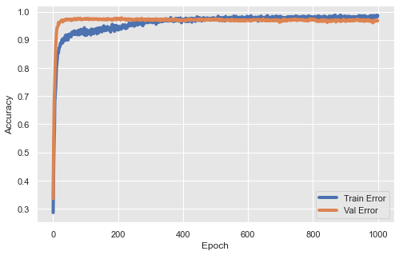

## Machine learning models - Neural networks

Here will follow the previous section, but build a fully connected neural networks for job description classification.

Prepare input
```
# input parameters
label_column = "label"
model_file = "model.h5"
history_file = "history.csv"
stats_file = "stats.cav"

label_dict = {
    "company": 0,
    "tasks": 1,
    "profile": 2,
    "benefits": 3
}

# make stats file for train data for normalizing data
df_stats = df_train.describe().loc[["mean", "std"]].transpose()

def norm(df, train_stats):
    """Normalized based on mean and std of training data

    Args:
        df: input features
        train_stats (df): statistics of train data, from pd.DataFrame.describe function

    Returns:
        Normalized df
    """
    return (df - train_stats['mean']) / train_stats['std']

def make_train_data():
    """make training inputs.

    Return:
        train_data: normilized features
        train_labels: target label
    """
    df_input_pm = df_train.iloc[np.random.permutation(len(df_train))]
    features = df_input_pm.drop(label_column, axis=1)
    train_features_norm = norm(features, df_stats)
    train_label = to_categorical(df_input_pm[label_column].map(label_dict))
    return train_features_norm, train_label

train_data, train_labels = make_train_data()
```

Build model
```
def build_model(X, learning_rate=0.001):
    """Build neural networks model.
    3-layers full-connected model with [16,8,4] neurons each.

    Args:
        X: input features
        learning_rate (float): learning rate of the learning algorithm

    Returns:
        NN: fully connected neural networks model
    """
    NN = Sequential()
    NN.add(Dense(16, activation='relu', input_dim=X.shape[1]))
    NN.add(Dropout(0.2))
    NN.add(Dense(8, activation='relu'))
    NN.add(Dropout(0.2))
    NN.add(Dense(4, activation='softmax'))

    NN.compile(
        optimizer=SGD(lr=0.005, momentum=0.8),
        loss='categorical_crossentropy',
        metrics=['accuracy']
    )
    return NN

model = build_model(train_data)
```

Training
```
clear_session()

history = model.fit(
    train_data,
    train_labels,
    validation_split = 0.3,
    epochs=1000,
    verbose=3
)
```

Check performance
```
df_history = pd.DataFrame(history.history)
def plot_history(df_history):
    """Plot learning curve for both training and testing data.
    """
    plt.figure()
    plt.xlabel('Epoch')
    plt.ylabel('Accuracy')
    plt.plot(df_history['accuracy'], label='Train Error')
    plt.plot(df_history['val_accuracy'], label = 'Val Error')
    plt.grid(True)
    plt.legend()
    plt.show()

plot_history(df_history)
```


As you can see, it is easy to build models once we have prepared the data. We just need to spend some time on hyper-parameter tuning.

I will introduce more advanced models in the following sections for other tasks.
