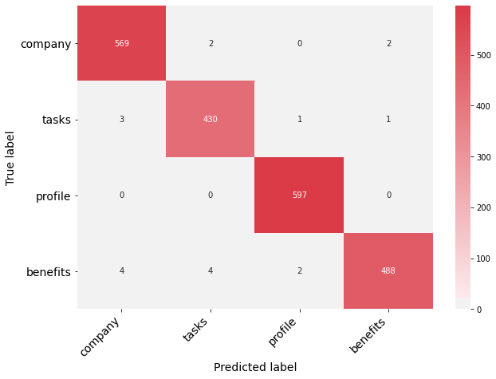

## Machine learning models

This notes contain the code of machine learning models on a specific task - job segmentation. The model can be used to automatic predict which part of the job description, general there are four parts in a typical job description:
- company introduction,
- tasks
- requirements
- benefits
It is a typical classification problem on NLP. And it is super useful in our daily analysis on label market.

The feature engineer have been done, feel free to check the [this notebooks](https://github.com/RuihaoQiu/NLP-projects/blob/master/notebooks/Job_segmentation/Feature_engineering_job_segmentation.ipynb) and the previous chapters. There are three types of features:
- Bag-of-words features: vectorize each text with tfidf-vectorizer and reduce the feature dimension with SVD down to 50 components.
- Text-based statistical features: e.g. word counts, characters counts, punctuation counts ... etc.
- Part of speech features: noun, verb, adj, ...

Here I will only focus on machine learning modelling, which will include model training, evaluation, parameter tuning and model comparison.

**Load data**
```
df_train = pd.read_csv("train_data.csv", index_col=0)
df_test = pd.read_csv("test_data.csv", index_col=0)

def load_data():
    X_train = df_train.drop("label", axis=1)
    y_train = df_train["label"]

    X_test = df_test.drop("label", axis=1)
    y_test = df_test["label"]
    return X_train, y_train, X_test, y_test

X_train, y_train, X_test, y_test = load_data()

print(X_train.shape, X_test.shape)
```
(2103, 63) (902, 63)

### Tree-based models
- Decision Tree
```
from sklearn import tree
DTC = tree.DecisionTreeClassifier(
    criterion="entropy",
    max_depth=8,
    min_samples_split=10,
    max_features="auto",
    random_state=100
)
DTC.fit(X_train, y_train)
train_score = DTC.score(X_train, y_train)
test_score = DTC.score(X_test, y_test)
print("Training accuracy: {0:5.2f}%.\
      \nTesting accuracy: {1:5.2f}%."
      .format(100*train_score, 100*test_score))
```
Training accuracy: 93.34%.<br>
Testing accuracy: 86.59%.

- Random Forest
```
from sklearn.ensemble import RandomForestClassifier
RFC = RandomForestClassifier(
    n_estimators=100,
    criterion="entropy",
    max_depth=5,
    min_samples_split=10,
    random_state=100,
)
RFC.fit(X_train, y_train)
train_score = RFC.score(X_train, y_train)
test_score = RFC.score(X_test, y_test)
print("Training accuracy: {0:5.2f}%.\
      \nTesting accuracy: {1:5.2f}%."
      .format(100*train_score, 100*test_score))
```
Training accuracy: 96.53%.<br>
Testing accuracy: 93.46%.

- Gradient Boosting Tree
```
from sklearn.ensemble import GradientBoostingClassifier
GBC = GradientBoostingClassifier(
    learning_rate=0.1,
    n_estimators=100,
    subsample=0.8,
    max_depth=2,
    random_state=100
)
GBC.fit(X_train, y_train)
train_score = GBC.score(X_train, y_train)
test_score = GBC.score(X_test, y_test)
print("Training accuracy: {0:5.2f}%.\
      \nTesting accuracy: {1:5.2f}%."
      .format(100*train_score, 100*test_score))
```
Training accuracy: 99.10%.<br>
Testing accuracy: 95.23%.

As you can see, it is easy to build models once we have prepared the data. We just need to spend some time on hyper-parameter tuning. More advanced model can largely increase the accuracy. The accuracy is very high now. Let's do further analysis.


**Confusion matrix**
One nice way to measure the model accuracy is confusion matrix. Here is the code the plot the heatmap.
```
import matplotlib.pyplot as plt
import seaborn as sns
from sklearn.metrics import confusion_matrix

labels = ["company", "tasks", "profile", "benefits"]
y_pred_train = GBC.predict(X_train)
y_pred_test = GBC.predict(X_test)
cm_train = confusion_matrix(y_train, y_pred_train, labels=labels)
cm_test = confusion_matrix(y_test, y_pred_test, labels=labels)

def print_confusion_matrix(confusion_matrix, class_names, figsize = (10,7), fontsize=14, cmap=plt.cm.RdBu_r):
    """Prints a confusion matrix as a heatmap.

    Inputs
    ---------
    confusion_matrix: numpy.ndarray
        The numpy.ndarray object returned from a call to sklearn.metrics.confusion_matrix.
    class_names: list
        An ordered list of class names, in the order they index the given confusion matrix.
    figsize: tuple
    fontsize: int
        Font size for axes labels.

    Outputs
    -------
    matplotlib.figure.Figure
        The resulting confusion matrix figure
    """
    df_cm = pd.DataFrame(
        confusion_matrix, index=class_names, columns=class_names,
    )
    fig = plt.figure(figsize=figsize)
    try:
        heatmap = sns.heatmap(df_cm, annot=True, fmt="d", cmap=cmap)
    except ValueError:
        raise ValueError("Confusion matrix values must be integers.")
    heatmap.yaxis.set_ticklabels(heatmap.yaxis.get_ticklabels(), rotation=0, ha='right', fontsize=fontsize)
    heatmap.xaxis.set_ticklabels(heatmap.xaxis.get_ticklabels(), rotation=45, ha='right', fontsize=fontsize)
    plt.ylabel('True label', fontsize=fontsize)
    plt.xlabel('Predicted label', fontsize=fontsize)
```
- Confusion matrix for training set
```
print_confusion_matrix(confusion_matrix=cm_train, class_names=labels)
```


- Confusion matrix for testing set
```
print_confusion_matrix(confusion_matrix=cm_test, class_names=labels)
```

